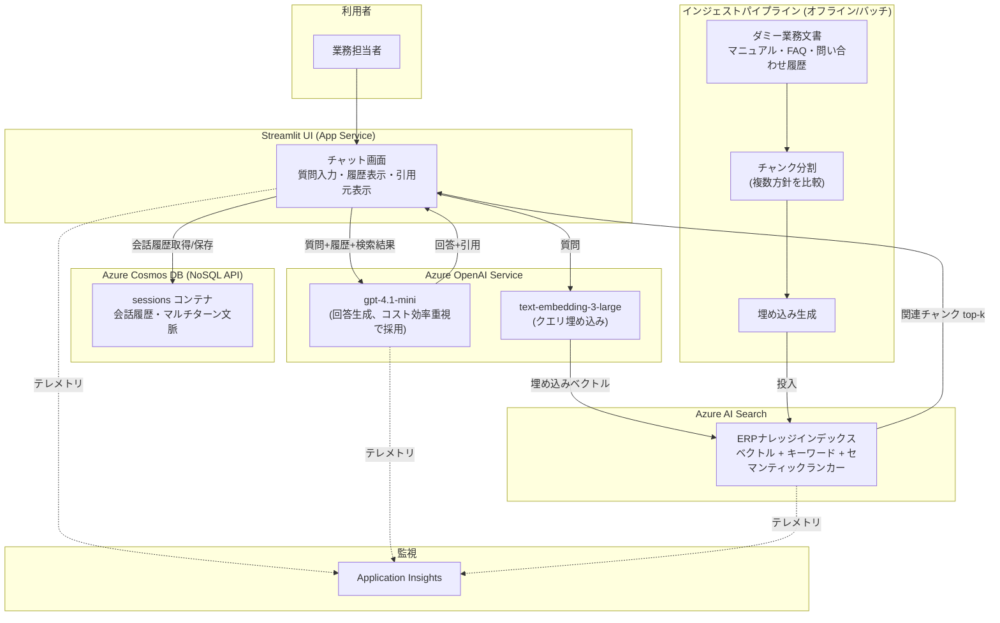

# azure-rag-erp-navigator

Azure OpenAI Service + Azure AI Search + Cosmos DB を用いた RAG ハンズオン検証プロジェクト。
ERP／基幹システムの導入マニュアル・FAQ・問い合わせ履歴を模したダミーデータセットに対し、
自然言語で質問すると導入・設定手順をナビゲートするチャットボットを構築し、精度・運用面を検証する。

過去の Neo4j × LangChain Agent によるグラフ×ベクトルのハイブリッド RAG 検証（golden_qa 平均 1.00）に対する、
Azure ネイティブスタックでの比較検証記事のための実装。

## アーキテクチャ



> 回答生成モデルは `gpt-4o` ではなく `gpt-4.1-mini` を採用している（コスト効率を優先した選定。
> 検証結果は `plans/` 配下の各ステップの計画ファイルを参照）。

## ディレクトリ構成

```
azure-rag-erp-navigator/
├── infra/bicep/        # IaC (Azure OpenAI / AI Search / Cosmos DB / App Service)
├── data/dummy_docs/    # ダミー業務マニュアル・FAQ・トラブルシュート事例
├── src/
│   ├── ingestion/       # チャンク分割・埋め込み生成・インデックス投入
│   ├── rag/             # ハイブリッド検索・回答生成・引用元整形
│   ├── session/         # Cosmos DB による会話履歴・セッション管理
│   └── app/             # Streamlit チャットUI
├── eval/                # golden_qa 評価スクリプト（キーワード網羅率 / RAGAS）
├── tests/               # pytest
├── .github/workflows/   # CI/CD (GitHub Actions)
└── docs/zenn-draft.md   # Zenn記事下書き
```

## 進捗ロードマップ

- [x] Step 1: Azure AI Search インデックス設計（チャンク分割方針・メタデータスキーマ・ハイブリッド検索設定）
- [x] Step 2: ダミー業務文書のチャンク化・埋め込み生成・インデックス投入パイプライン
- [x] Step 3: Cosmos DB での会話履歴・セッション管理
- [x] Step 4: RAG 回答生成ロジック（引用元提示含む）
- [x] Step 5: Streamlit チャットUI
- [x] Step 6: golden_qa 評価スクリプト（キーワード網羅率 / RAGAS）
- [x] Step 7: Azure App Service デプロイ + GitHub Actions CI/CD
- [x] Step 8: Bicep による IaC 化
- [ ] Zenn記事下書き・README整備

## セットアップ

> 各ステップの実装が進むにつれて随時更新します。

### 前提

- Python 3.12+
- [uv](https://docs.astral.sh/uv/)（依存関係・仮想環境管理）
- Azure サブスクリプション（Azure OpenAI / AI Search / Cosmos DB / App Service）

### 依存関係のインストール

```bash
uv sync
```

### 環境変数

`.env.example` をコピーして `.env` を作成し、Azure リソースの接続情報を設定してください（詳細は各ステップ実装時に追記）。

```bash
cp .env.example .env
```

### PR前の品質チェック

コードを変更したら、PRを出す前に以下を実行し、緑になってから push してください。
GitHub Actions（`.github/workflows/ci.yml`）でも同じスクリプトが自動的にもう一度実行されます。
ローカルとCIでチェック内容を1つのスクリプトに集約しているため、「ローカルでは通ったのにCIで落ちる」
という食い違いが起きません。

```bash
./scripts/ci_check.sh
```

（pytest / ruff / mypy / vulture をまとめて実行します。Azure実リソースへの疎通確認
`scripts/verify_azure_connectivity.py` は含まれないため、必要な場合は別途手動で実行してください。）

### チャットUIの起動

Azure OpenAI / AI Search / Cosmos DB への接続情報を `.env` に設定した上で、以下を実行してください。

```bash
uv run streamlit run src/app/streamlit_app.py
```

ブラウザで http://localhost:8501 が開き、ERPNaviについて質問できます。

### Azure App Serviceへのデプロイ

1. Azureポータルで App Service（コード、Python 3.12、Linux、B1プラン以上を推奨）を作成する
2. 対象App Serviceの「設定 > 全般設定」でスタートアップコマンドを設定する
   ```
   python -m streamlit run src/app/streamlit_app.py --server.port ${PORT:-8000} --server.address 0.0.0.0 --server.headless true
   ```
3. 「設定 > 環境変数」（アプリケーション設定）に、`.env.example` と同じキーで本番用の値を設定する
4. アプリケーション設定に `SCM_DO_BUILD_DURING_DEPLOYMENT=true` を追加する（zip deploy後にOryxが`requirements.txt`からビルドするために必要）
5. 「概要 > 発行プロファイルの取得」でファイルをダウンロードし、その内容をGitHub Secretsの `AZURE_WEBAPP_PUBLISH_PROFILE` に登録する
6. GitHub Actions変数（Secretsではなく Variables）に `AZURE_WEBAPP_NAME` としてApp Service名を登録する
7. `main` ブランチへのpush（PRマージ）で `.github/workflows/cd.yml` が自動的にデプロイする

監視・ログは、対象App Serviceの「Application Insights」を有効化するとリクエスト数・レスポンスタイム・
例外が自動収集される。アプリケーションログ（ファイルシステム）を有効化すると、コード側の`logging`
出力をログストリームで確認できる。詳細な設計判断は `plans/feat-step7-app-service-deploy.md` を参照。

### IaC（Bicep）

`infra/bicep/` に、Azure OpenAI / AI Search / Cosmos DB / App Service / 監視を一括
プロビジョニングするBicepテンプレートを用意している（Step1〜7で個別にポータル作成した
リソースを事後的にコード化したもの）。構文チェックのみで、実デプロイでの動作確認は
まだ行っていない（詳細は `plans/feat-step8-bicep-iac.md` 参照）。

```bash
./scripts/validate_bicep.sh
```

実際にデプロイする場合は、`infra/bicep/parameters/dev.bicepparam` のモデル名・
バージョンを、デプロイ時点でAzureポータル/CLIから確認した実在の値に書き換えてから
以下を実行する。

```bash
az deployment group create \
  --resource-group <リソースグループ名> \
  --template-file infra/bicep/main.bicep \
  --parameters infra/bicep/parameters/dev.bicepparam
```
