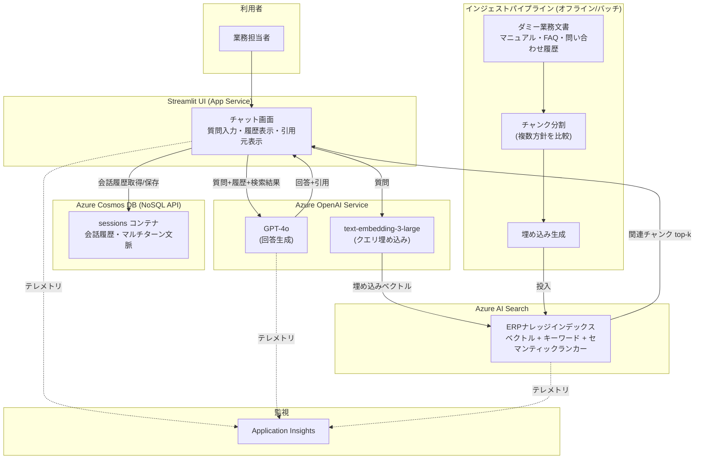

# azure-rag-erp-navigator

Azure OpenAI Service + Azure AI Search + Cosmos DB を用いた RAG ハンズオン検証プロジェクト。
ERP／基幹システムの導入マニュアル・FAQ・問い合わせ履歴を模したダミーデータセットに対し、
自然言語で質問すると導入・設定手順をナビゲートするチャットボットを構築し、精度・運用面を検証する。

過去の Neo4j × LangChain Agent によるグラフ×ベクトルのハイブリッド RAG 検証（golden_qa 平均 1.00）に対する、
Azure ネイティブスタックでの比較検証記事のための実装。

## アーキテクチャ



## ディレクトリ構成

```
azure-rag-erp-navigator/
├── infra/bicep/        # IaC (Azure OpenAI / AI Search / Cosmos DB / App Service)
├── data/dummy_docs/    # ダミー業務マニュアル・FAQ・トラブルシュート事例
├── src/
│   ├── ingestion/       # チャンク分割・埋め込み生成・インデックス投入
│   ├── rag/             # ハイブリッド検索・回答生成・引用元整形
│   ├── session/         # Cosmos DB による会話履歴・セッション管理
│   └── app/             # Streamlit チャットUI
├── eval/                # golden_qa 評価スクリプト（キーワード網羅率 / RAGAS）
├── tests/               # pytest
├── .github/workflows/   # CI/CD (GitHub Actions)
└── docs/zenn-draft.md   # Zenn記事下書き
```

## 進捗ロードマップ

- [x] Step 1: Azure AI Search インデックス設計（チャンク分割方針・メタデータスキーマ・ハイブリッド検索設定）
- [x] Step 2: ダミー業務文書のチャンク化・埋め込み生成・インデックス投入パイプライン
- [ ] Step 3: Cosmos DB での会話履歴・セッション管理
- [ ] Step 4: RAG 回答生成ロジック（引用元提示含む）
- [ ] Step 5: Streamlit チャットUI
- [ ] Step 6: golden_qa 評価スクリプト（キーワード網羅率 / RAGAS）
- [ ] Step 7: Azure App Service デプロイ + GitHub Actions CI/CD
- [ ] Step 8: Bicep による IaC 化
- [ ] Zenn記事下書き・README整備

## セットアップ

> 各ステップの実装が進むにつれて随時更新します。

### 前提

- Python 3.12+
- [uv](https://docs.astral.sh/uv/)（依存関係・仮想環境管理）
- Azure サブスクリプション（Azure OpenAI / AI Search / Cosmos DB / App Service）

### 依存関係のインストール

```bash
uv sync
```

### 環境変数

`.env.example` をコピーして `.env` を作成し、Azure リソースの接続情報を設定してください（詳細は各ステップ実装時に追記）。

```bash
cp .env.example .env
```
